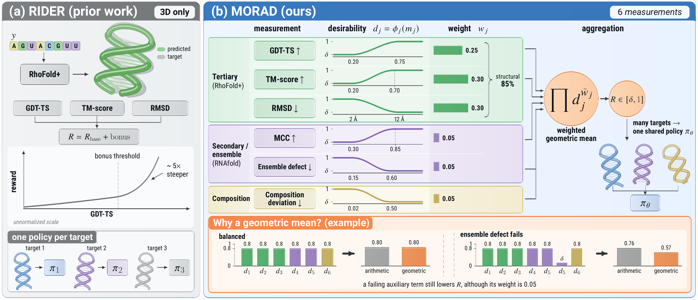
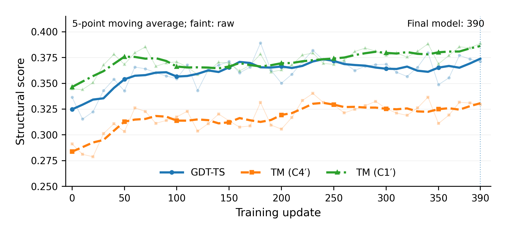

<div align="center">

# MORAD

### Reinforcement Learning with Multi-Objective Rewards for RNA Inverse Design

**Jixin Tang**<sup>\*</sup> · **Ji Guo**<sup>\*</sup> · **Jun Zhao**<sup>†</sup>

Fudan University

<sub><sup>\*</sup>Equal contribution &nbsp;&nbsp; <sup>†</sup>Corresponding author</sub>

<br>

[](https://gabrile166.github.io/MORAD/)
[](https://huggingface.co/Gabriel166/MORAD)
[](https://huggingface.co/datasets/Gabriel166/MORAD-data)
[](LICENSE)
[](docs/INSTALL.md)
[](docs/INSTALL.md)

[Project page](https://gabrile166.github.io/MORAD/) •
[Overview](#overview) •
[Results](#results) •
[Installation](#installation) •
[Quick start](#quick-start) •
[Reproducing the paper](#reproducing-the-paper) •
[Citation](#citation)

</div>

<br>

<p align="center">
  
</p>
<p align="center"><sub><b>MORAD training loop.</b> Backbone-conditioned sampling produces candidate sequences; three evaluation channels provide the six-component reward and group-relative weights; forward-noised candidates train the shared policy under a frozen-reference constraint.</sub></p>

## Overview

**MORAD** is an online reinforcement learning framework for backbone-conditioned
RNA diffusion models. Given a target 3D backbone, the model generates nucleotide
sequences that fold into it. MORAD post-trains a **single shared policy across
diverse target backbones**, so the trained model designs sequences for a new
backbone directly at inference, with no per-target optimization.

- **Shared-policy online post-training.** Backbone-conditioned group sampling,
  group-relative reward normalization and a forward-process (DiffusionNFT-style)
  diffusion objective, applied to the pretrained [RIDE](https://github.com/COLA-Laboratory/RIDER) model.
- **Six-objective reward.** Tertiary geometry (GDT-TS, TM-score, RMSD), base
  pairing (MCC), ensemble behavior (normalized ensemble defect) and sequence
  composition, each mapped to a bounded desirability score and combined with a
  weighted geometric mean.
- **Consistent gains.** Compared with a tertiary-structure-only reward, the
  multi-objective reward improves **10 of the 11** evaluation metrics that have a
  preferred direction.
- **State of the art.** Applied to pretrained RIDE, MORAD improves GDT-TS by
  **+16.0%** (0.3300 → 0.3827) and pairing MCC by **+19.4%** (0.6110 → 0.7295),
  and reduces normalized ensemble defect by **−27.5%** (0.3906 → 0.2830),
  outperforming RiboDiffusion, gRNAde and RDesign across tertiary structure,
  secondary-structure pairing and thermodynamic quality.

### The MORAD reward

<p align="center">
  
</p>

Each measurement $m_j$ is mapped to a bounded desirability score between a
low anchor $a_j$ and a high anchor $b_j$, and the scores are combined by a
weighted geometric mean over the available measurements $\mathcal J$:

$$
u_j=\mathrm{clip}\Big(\tfrac{m_j-a_j}{b_j-a_j},0,1\Big),\qquad
d_j=\max\Big(\delta,\tfrac{1-\cos(\pi u_j)}{2}\Big),\qquad
R=\exp\Big(\sum_{j\in\mathcal J}\tilde w_j\log d_j\Big),\quad
\tilde w_j=\frac{w_j}{\sum_{k\in\mathcal J}w_k}.
$$

| Measurement | $a_j$ | $b_j$ | $w_j$ |
|---|:---:|:---:|:---:|
| GDT-TS | 0.20 | 0.75 | 0.25 |
| TM-score | 0.20 | 0.70 | 0.30 |
| RMSD (Å) | 12.0 | 2.0 | 0.30 |
| Secondary-structure MCC | 0.30 | 0.85 | 0.05 |
| Ensemble defect / nucleotide | 0.60 | 0.15 | 0.05 |
| Composition deviation | 0.50 | 0.02 | 0.05 |

The reward is implemented in [`src/rl/reward.py`](src/rl/reward.py); the weights
are derived in [`scripts/reward/reward_design.py`](scripts/reward/reward_design.py).

## Results

All models are evaluated on the same **153 test targets** with eight designs per
target. MORAD is the policy after update 390. Best values in **bold**. The
numbers are also provided as CSV files in [`results/`](results).

<details open>
<summary><b>Table 1 · Tertiary structure</b> (candidate 0 of each target, RhoFold+)</summary>
<br>

| Model | GDT-TS ↑ | TM (C4′) ↑ | RMSD (Å) ↓ | TM (C1′) ↑ | Success ↑ | Recovery ↑ | lDDT (C4′) ↑ | pLDDT ↑ | Coarse clash ↓ |
|---|---:|---:|---:|---:|---:|---:|---:|---:|---:|
| RiboDiffusion | 0.3132 | 0.2839 | 10.9215 | 0.3613 | 0.2549 | **0.5165** | 0.6174 | **0.6937** | 73.5383 |
| gRNAde (T=0.1) | 0.3591 | 0.3179 | 8.8374 | 0.3642 | 0.2484 | 0.5115 | 0.6607 | 0.6482 | 23.7261 |
| RDesign | 0.3291 | 0.2902 | 10.3441 | 0.3392 | 0.2549 | 0.4720 | 0.6368 | 0.6202 | 40.4457 |
| RIDE | 0.3300 | 0.2841 | 9.7199 | 0.3538 | 0.2484 | 0.5039 | 0.6622 | 0.6671 | 22.7503 |
| **MORAD** | **0.3827** | **0.3400** | **7.9196** | **0.3855** | **0.3007** | 0.5056 | **0.6774** | 0.6726 | **11.9438** |

</details>

<details open>
<summary><b>Table 2 · Secondary-structure pairing</b> (candidate 0; EternaFold vs. native base pairs)</summary>
<br>

| Model | Precision ↑ | Recall ↑ | F1 ↑ | MCC ↑ |
|---|---:|---:|---:|---:|
| RiboDiffusion | 0.3563 | 0.3074 | 0.3212 | 0.3267 |
| gRNAde (T=0.1) | 0.7276 | 0.6099 | 0.6482 | 0.6734 |
| RDesign | 0.7084 | 0.6110 | 0.6462 | 0.6566 |
| RIDE | 0.6472 | 0.5717 | 0.5939 | 0.6110 |
| **MORAD** | **0.7824** | **0.6816** | **0.7226** | **0.7295** |

</details>

<details open>
<summary><b>Table 3 · Thermodynamics</b> (153 targets, ViennaRNA)</summary>
<br>

| Model | MFE ∼ | EFE ∼ | NED ↓ | PE ↓ | MFEfreq ↑ |
|---|---:|---:|---:|---:|---:|
| RiboDiffusion | -21.716 | -22.847 | 0.6056 | 0.4284 | 0.2980 |
| gRNAde (T=0.1) | -28.092 | -28.918 | 0.3458 | 0.2652 | 0.4289 |
| gRNAde (T=0.8) | -25.186 | -26.212 | 0.3830 | 0.3260 | 0.3266 |
| RDesign | -28.863 | -29.708 | 0.3349 | 0.2775 | 0.3961 |
| RIDE | -23.614 | -24.643 | 0.3906 | 0.3059 | 0.3350 |
| **MORAD** | -30.149 | -30.937 | **0.2830** | **0.2102** | **0.4402** |

<sub>MFE / EFE: minimum and ensemble free energy (kcal/mol), shown for context. NED: normalized ensemble defect. PE: positional entropy. MFEfreq: probability of the minimum-free-energy structure.</sub>

</details>

<details open>
<summary><b>Table 4 · Reward comparison</b> (same pretrained RIDE, data, optimizer and schedule; only the reward differs)</summary>
<br>

| Measurement | RIDE | + Structural reward | + MORAD reward |
|---|---:|---:|---:|
| GDT-TS ↑ | 0.3300 | 0.3627 | **0.3694** |
| TM-score ↑ | 0.2841 | 0.3194 | **0.3358** |
| RMSD (Å) ↓ | 9.720 | 8.369 | **8.207** |
| C1′ TM ↑ | 0.3538 | 0.3818 | **0.3919** |
| MCC ↑ | 0.6208 | 0.6612 | **0.6978** |
| F1 ↑ | 0.6103 | 0.6568 | **0.6901** |
| ED (nt) ↓ | 29.08 | 26.85 | **24.27** |
| ED/nt ↓ | 0.3872 | 0.3569 | **0.3256** |
| Recovery ↑ | 0.5033 | 0.5097 | **0.5124** |
| H<sub>pair</sub> ↓ | 0.3249 | 0.2851 | **0.2800** |
| p<sub>MFE</sub> ↑ | 0.3281 | **0.3880** | 0.3847 |
| MFE (kcal/mol) | -23.77 | -29.81 | -26.49 |
| GC fraction | 0.5304 | 0.5912 | 0.4970 |
| Hamming diversity | 0.2971 | 0.2224 | 0.2607 |

</details>

<p align="center">
  
</p>
<p align="center"><sub><b>Held-out structural scores over all 40 evaluations during training</b> (updates 0–390). Thick lines: centred five-point moving average; faint traces: raw scores. GDT-TS rises from 0.3365 to 0.3711 and C4′ TM-score from 0.2912 to 0.3296.</sub></p>

## Installation

MORAD runs on Linux with NVIDIA GPUs (training: 4 GPUs; evaluation: 1 GPU).

```bash
git clone https://github.com/Gabrile166/MORAD.git
cd MORAD
bash scripts/setup_third_party.sh        # RhoFold+, US-align, EternaFold, RiboDiffusion (pinned)
```

Create the two Python environments, one for MORAD and one for the RhoFold+ structure-prediction worker:

```bash
conda create -n morad python=3.10 -y && conda activate morad
pip install -r requirements-ride-evaluation.txt
conda install -y -c conda-forge -c bioconda viennarna

conda create -n rhofold-plus python=3.10 -y && conda activate rhofold-plus
pip install -r requirements-rhofold-plus.txt
```

Configure the tool paths and download the checkpoints and data:

```bash
conda activate morad
cp scripts/env.example.sh scripts/env.sh && source scripts/env.sh
bash scripts/download_assets.sh          # RIDE + RhoFold+ weights, data pools, MORAD checkpoint
python verify_setup.py                   # checks checkpoints, RhoFold+, US-align, RNAfold and pools
```

See [docs/INSTALL.md](docs/INSTALL.md) for details and [docs/DATA.md](docs/DATA.md) for the data format.

## Quick start

**Evaluate the released MORAD model** on the 153 test targets (all metrics of Tables 1–3):

```bash
bash scripts/evaluate_test153.sh morad
```

**Train MORAD** from pretrained RIDE (4 GPUs, 390 updates):

```bash
bash scripts/train_morad.sh
```

**Evaluate any training snapshot:**

```bash
bash scripts/evaluate_test153.sh my_run outputs/morad/validation/policy_step000390.pt
```

## Reproducing the paper

| Paper item | Command |
|---|---|
| MORAD training | `bash scripts/train_morad.sh` |
| Tables 1–3, sequence diversity | `bash scripts/evaluate_test153.sh {ride, morad, --fasta <baseline> <dir>}` <br> `python scripts/eval/collect_tables.py --runs ...` |
| Table 4 (reward comparison) | `bash scripts/train_reward_comparison.sh` <br> `python scripts/eval/collect_tables.py --table4 --runs ...` |
| Checkpoint comparison | `configs/eval/test153_8cand.yaml` <br> `python scripts/eval/collect_tables.py --checkpoints --runs ...` |
| Figure 3 | `python scripts/plot_training_curve.py --results outputs/morad/validation/async_results.jsonl` |

Step-by-step commands, baseline generation (RiboDiffusion, gRNAde, RDesign) and
the metric definitions are in [docs/REPRODUCE.md](docs/REPRODUCE.md).

### Data

| Split | Targets | Length (nt) |
|---|---:|---|
| Training | 527 | 27–258 (median 75) |
| Test | 153 | 15–186 (median 65) |

The test set is built separately from the training set. It comprises 71
RNA3DB entries, drawn from RNA3DB components that contain no training target,
and 82 entries curated from the RCSB PDB. No test sequence exactly matches a
training sequence. Both sets are released on
[Hugging Face](https://huggingface.co/datasets/Gabriel166/MORAD-data), together
with the [MORAD checkpoint](https://huggingface.co/Gabriel166/MORAD).

## Repository structure

```text
MORAD/
├── train.py                     # MORAD training (smoke / train / resume / eval)
├── evaluate.py                  # test-set evaluation of a policy or of precomputed sequences
├── verify_setup.py              # installation check
├── configs/
│   ├── morad.yaml               # the reported MORAD run
│   ├── ablation/                # reward comparison: structural_only.yaml, morad_reward.yaml
│   ├── eval/                    # test153.yaml, test153_8cand.yaml, test153_precomputed.yaml, validation.yaml
│   └── ride_policy.yaml         # RIDE network definition used for sampling
├── src/
│   ├── rl/                      # rollout, reward, advantage, DiffusionNFT-style loss, trainer, validation
│   ├── evaluation/              # metrics, RhoFold+ / US-align scoring, reporting
│   ├── data/                    # featurization and RNA3DB parsing
│   └── model.py, diffusion.py   # RIDE backbone-conditioned diffusion model
├── scripts/
│   ├── train_morad.sh           # main run
│   ├── train_reward_comparison.sh
│   ├── evaluate_test153.sh      # full evaluation of one model
│   ├── eval/                    # pairing / thermodynamics / folding metrics, table collection
│   ├── baselines/               # RiboDiffusion inference on the test pool
│   ├── reward/                  # reward-weight derivation
│   ├── plot_training_curve.py
│   ├── setup_third_party.sh, download_assets.sh, env.example.sh
│   └── rhofold_oracle_worker.py # RhoFold+ structure-prediction worker
├── results/                     # reported numbers (CSV)
├── docs/                        # INSTALL.md, DATA.md, REPRODUCE.md
└── tests/
```

## Citation

If you find MORAD useful, please cite:

```bibtex
@misc{tang2026morad,
  title  = {{MORAD}: Reinforcement Learning with Multi-Objective Rewards for {RNA} Inverse Design},
  author = {Tang, Jixin and Guo, Ji and Zhao, Jun},
  year   = {2026}
}
```

## Acknowledgments

MORAD builds on the RIDE model and code of
[RIDER](https://github.com/COLA-Laboratory/RIDER) (Apache-2.0). We also use
[RhoFold+](https://github.com/ml4bio/RhoFold),
[US-align](https://github.com/pylelab/USalign),
[ViennaRNA](https://www.tbi.univie.ac.at/RNA/),
[EternaFold](https://github.com/eternagame/EternaFold) and
[RNA3DB](https://github.com/marcellszi/rna3db), and compare with
[RiboDiffusion](https://github.com/ml4bio/RiboDiffusion),
[gRNAde](https://github.com/chaitjo/geometric-rna-design) and
[RDesign](https://github.com/A4Bio/RDesign). We thank the authors for making
their work available.

## License

This project is released under the [Apache License 2.0](LICENSE).
