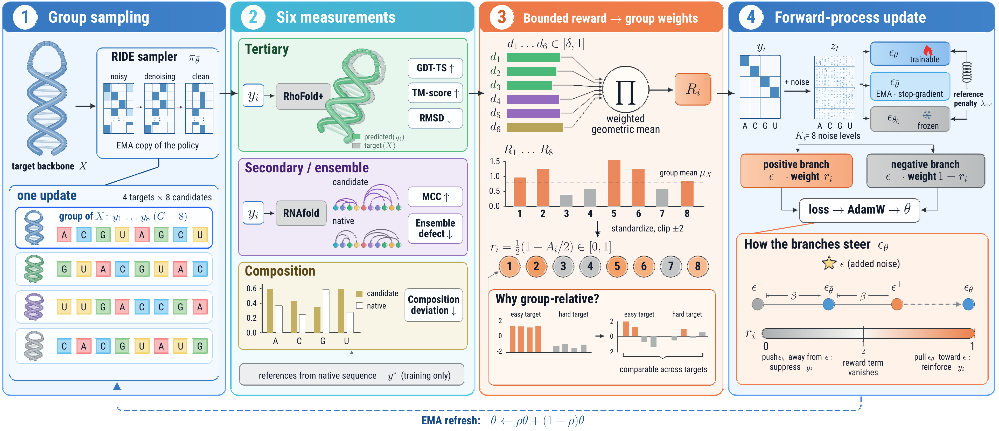

# MORAD

**Jixin Tang**<sup>\*</sup> · **Ji Guo**<sup>\*</sup> · **Jun Zhao**<sup>†</sup> — Fudan University

<sub><sup>\*</sup>Equal contribution &nbsp;&nbsp; <sup>†</sup>Corresponding author</sub>

Official code for **MORAD: Reinforcement Learning with Multi-Objective
Rewards for RNA Inverse Design**: the pretrained RIDE backbone-conditioned RNA
diffusion model, post-trained online for 390 updates with the six-objective
MORAD reward. One shared policy designs nucleotide sequences for any target 3D
backbone, with no per-target optimization.

[Project page](https://gabrile166.github.io/MORAD/) ·
[Model](https://huggingface.co/MORAD-RNA/MORAD-RIDE) ·
[Data](https://huggingface.co/datasets/MORAD-RNA/MORAD-Targets)

<p align="center">
  
</p>
<p align="center"><sub><b>MORAD training loop.</b> Backbone-conditioned sampling produces candidate sequences; three evaluation channels provide the six-component reward and group-relative weights; forward-noised candidates train the shared policy under a frozen-reference constraint.</sub></p>

## Results on the 153 test targets

| Model | GDT-TS ↑ | TM-score ↑ | RMSD (Å) ↓ | Pairing MCC ↑ | NED ↓ |
|---|:---:|:---:|:---:|:---:|:---:|
| RiboDiffusion | 0.3132 | 0.2839 | 10.9215 | 0.3267 | 0.6056 |
| gRNAde | 0.3591 | 0.3179 | 8.8374 | 0.6734 | 0.3458 |
| RDesign | 0.3291 | 0.2902 | 10.3441 | 0.6566 | 0.3349 |
| RIDE | 0.3300 | 0.2841 | 9.7199 | 0.6110 | 0.3906 |
| **MORAD-RIDE** | **0.3827** | **0.3400** | **7.9196** | **0.7295** | **0.2830** |

<sub>Structures predicted with RhoFold+ (TM-score on C4′), base pairs with
EternaFold, normalized ensemble defect (NED) with ViennaRNA. gRNAde at T = 0.1.</sub>

## Quick start

> Linux with NVIDIA GPUs. Training uses 4 GPUs and takes about **2 hours on
> 4 × RTX 3090**; evaluation runs on a single GPU.

**1 · Install**

```bash
mkdir morad-workspace && cd morad-workspace    # external tools go to ./third_party
git clone https://github.com/Gabrile166/MORAD.git && cd MORAD
bash scripts/setup_third_party.sh              # RhoFold+, US-align, EternaFold, RiboDiffusion

conda create -n morad python=3.10 -y && conda activate morad
pip install -r requirements-ride-evaluation.txt
conda install -y -c conda-forge -c bioconda viennarna

conda create -n rhofold-plus python=3.10 -y && conda activate rhofold-plus
pip install -r requirements-rhofold-plus.txt   # structure-prediction worker
```

**2 · Download the checkpoints and data**

```bash
conda activate morad
cp scripts/env.example.sh scripts/env.sh && source scripts/env.sh
bash scripts/download_assets.sh                # RIDE, RhoFold+, MORAD-RIDE, MORAD-Targets
python verify_setup.py                         # checks checkpoints, tools and data
```

**3 · Evaluate the released model**

```bash
bash scripts/evaluate_test153.sh morad         # -> outputs/eval/test153/morad/
python scripts/eval/collect_tables.py --runs MORAD=morad
```

**4 · Train MORAD and evaluate your own run**

```bash
bash scripts/train_morad.sh                    # 4 GPUs, 390 updates
bash scripts/evaluate_test153.sh my_run outputs/morad/validation/policy_step000390.pt
python scripts/eval/collect_tables.py --runs MORAD=morad,Mine=my_run
```

Loading the policy weights directly:

```python
import torch

state_dict = torch.load("artifacts/models/morad/morad_update390.pt",
                        map_location="cpu")["model"]
# RIDE network definition: configs/ride_policy.yaml
```

Environment details are in [docs/INSTALL.md](docs/INSTALL.md), the data format in
[docs/DATA.md](docs/DATA.md), and the per-table commands in
[docs/REPRODUCE.md](docs/REPRODUCE.md).

## Citation

```bibtex
@misc{tang2026morad,
  title  = {{MORAD}: Reinforcement Learning with Multi-Objective Rewards for {RNA} Inverse Design},
  author = {Tang, Jixin and Guo, Ji and Zhao, Jun},
  year   = {2026}
}
```

## Acknowledgments

MORAD builds on the RIDE model and code of
[RIDER](https://github.com/COLA-Laboratory/RIDER) (Apache-2.0). We also use
[RhoFold+](https://github.com/ml4bio/RhoFold),
[US-align](https://github.com/pylelab/USalign),
[ViennaRNA](https://www.tbi.univie.ac.at/RNA/),
[EternaFold](https://github.com/eternagame/EternaFold) and
[RNA3DB](https://github.com/marcellszi/rna3db), and compare with
[RiboDiffusion](https://github.com/ml4bio/RiboDiffusion),
[gRNAde](https://github.com/chaitjo/geometric-rna-design) and
[RDesign](https://github.com/A4Bio/RDesign). We thank the authors for making
their work available.

## License

Released under the [Apache License 2.0](LICENSE).
